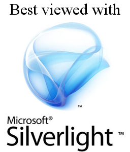

class: center, middle

# Service Worker and   the Appification of the Web

Nolan Lawson

.footnote[.right.muted[Press P for speaker notes]]

???

This is a talk about Service Workers and how they "appify" the web.

Alternative title for my French audience: "Service Workers and web appy-ness." Francophones will get the joke.

---

# Service Worker

???

Now, if you're a web developer, you've probably heard a lot about Service Workers. How they're going to "revolutionize" the
web platform. How they change everything.

So if you know nothing else about Service Workers, what can you conclude? Well, they're certainly
hot, and they "move the web forward."

--

## It "moves the web forward"

???

But what exactly does "move the web forward" mean?
We hear this phrase bandied around a lot, but 
what direction is the web moving in? Why does it need to move at all? Why is Service Worker an important part of that?

Well, to understand what "move the web forward" means, you need to take a look at where the web has been. I'm a firm
believer that history can provide valuable lessons for the future – I know, a controversial opinion an industry where
we throw out our Javascript framework every 2 years! – but in this case it's definitely true.

---

# 2004: Beginnings of HTML5

???

So let's flash back to 2004, which is around the time HTML5 got started, in
one of the earliest efforts to really "push the web forward." What was motivating it?

Well, let's remember the context of the time. IE6 was the most popular browser, with [80% market share](http://news.bbc.co.uk/2/hi/technology/4037833.stm).
Older versions of IE took up another 15%. IE6 was the state-of-the-art for the web platform, so it was a 

So IE6 was the state of the art at the time. It was obviously a very different web from the one we have today &ndash; a much less feature-rich web.

--

> "There is a rising threat of single-vendor solutions"

.footnote[.right[– [Original position paper on HTML5 (2004)](https://www.w3.org/2004/04/webapps-cdf-ws/papers/opera.html)]]

???

Against this backdrop, a ragtag group from Mozilla and Opera put forward the first position paper on what would later become HTML5.
Their motivating factor? A "rising threat of single-vendor solutions?"

---

# Rising threats

???

So what were these rising threats?

--
* Java (Sun)
* Flash (Macromedia)
* XUL (Mozilla)
* Silverlight/Avalon (Microsoft)

.footnote[.right[– [Chris Kaminski, Web Standards Project (2004)](http://www.webstandards.org/2004/10/01/the-web-as-platform/)]]

???

Well, as Chris Kaminski from the Web Standards Project says, there were lots of vendors "rushing in to stake their turf"
in the emerging "rich app" market, including Java, Flash, XUL, and Silverlight (then known as Project Avalon).

Ian Hickson, Godfather of HTML5, also said ["we were really scared of Silverlight"](https://youtu.be/xIxDJof7xxQ).

What these single-vendor solutions were doing was rushing in to fill a void in the web platform. The W3C at the time was mostly interested in semantic web and XHTML 2, not rich "web apps." So these platforms filled that need.

---

# Flash/Silverlight posed a real threat

???

So at the time, technologies like Flash and Silverlight posed a real challenge to the open web.

--

## In many ways, they were just better

???

If you wanted to build really cutting-edge web applications, then Flash,
Silverlight, and similar technologies were compelling alternatives to the open web, because they had a lot more crucial features that the web lacked.

You can't really blame developers or users for preferring these platforms at the time. It was just a better way
to build good user experiences. People were voting with their feet, against the web.

---

# HTML5 was a response to Flash/Silverlight

???

So in this light, the movement towards HTML5, which began in 2004, can be seen as a response to the challenges to the web posed by Flash and Silverlight.

--
* File upload
* Video
* Clipboard
* Canvas
* SVG
* Animations
* etc.

???

And ultimately this competitive environment was good for the web. 
This is where a lot of features of HTML5 come from. This is why we have file uploads, video, canvas, clipboard, SVG, CSS animations, etc.

Now, this wasn't a matter of just copy-pasting those APIs from Flash or Silverlight and calling it a day. There was hard work here
to make sure these APIs were standardized, and that they didn't sacrifice user security, privacy, and performance model of the web for the sake of new features.

But the web didn't just stand still when it was getting outcompeted. It looked at what proprietary platforms like Silverlight and Flash were doing, 
and made sure it could remain competitive, even as the context around it changed.

---

# HTML5 won!

???

And it worked! Today, Flash and Silverlight are slowly fading away. Java applets are a distant memory. 
HTML5 reigns supreme.

Today, if you want to build a rich desktop application – whether it's an email app, a video-sharing site, or a 3D game – you can
do it today with purely open web technologies. This is an amazing accomplishment.

--

## ...but it might not have.

???

But the web isn't something that just automatically wins. It won because people at browser vendors and
in the larger web community fought to keep it competitive.

It's not a fait accompli that "the web always wins."
The web didn't win through magic, or historical inevitability, or birthright.
It won because it evolved, because it adapted to changing contexts.

---

# A future that could have been

.center[]

???

We could have very easily ended up in a future where web sites were optimized for Flash, or for Silverlight, or maybe
for both. Maybe the web would have been segregated based on proprietary technologies.

"Designed for Flash." "Works best in Silverlight!" "Java support coming soon." 

You laugh, but in a sense this possible future isn't so far from our present reality.
The web may have defeated Flash and Silverlight, but today we have this:

---

# Today's reality

.center[]

???

"Download on the App Store." "Get it on Google Play." "Windows Phone version coming soon!" "Amazon Fire version coming soon!" 

Because it turned out that the web only really won on desktop. Those same experiences that on desktop
are largely consumed via the open web – social media, email, news readers – on mobile, they're largely
consumed via native apps.

And once again, you can't really blame developers for flocking to these platforms. For the rich experiences they're trying to build, these platforms obviously offer something that the web can't. Once again, people are voting with their feet, against the web.

---

# A new threat

> "There's a new existential threat... It's not Flash and Silverlight – it's native apps, 
> \[which are\] feeding off the web, and arguably killing the web."

.footnote[.right[– [Bruce Lawson (2016)](https://www.youtube.com/watch?v=YxQUxCsNomM)]]

???

As Bruce Lawson notes, today there's a new existential threat to the web. But this time it's not Flash or Silverlight –
it's native apps, which are feeding off the web, and arguably killing the web.

---

# Progressive Web Apps: a new hope

???

This is where Progressive Web Apps (or PWAs) come in. In the same way
that HTML5 was a response to the challenges presented by Flash and Silverlight, PWAs are a response to native mobile apps.

--

## Like HTML5, a loose collection of new technologies:
* Service Worker
* App Manifest

???

And like HTML5 before it, PWAs are less a single monolithic technology and more a loose collection of APIs defining new
capabilities for the web. The two most important are Service Worker and App Manifests. I'll talk about App Manifest
later, but first let's delve into the most important one, Service Worker. Where does it fit in?

---

# What are native apps so good at?

???

Well to answer that, let's first try to figure out what native apps are so darn good at in the first place? Why are developers
preferring to build for native (at greater cost, since they have to build the same app multiple times!)
rather than building for the web? What do they get that the web isn't offering?

--

* Offline
* Push notifications
* Background sync

???

Well, there are lots, but here are a few.

Offline support &ndash; can I trust that this app will open when I tap on the icon, even if I don't have a reliable network connection?

Push notifications &ndash; really great for user engagement &ndash; can I provide timely information to my users even when my site/app isn't open?

Background sync &ndash; isn't it nice when you open a native app you haven't used in a long time, but it still has the freshest content, the freshest emails, the freshest tweets, because it synced in the background?

Incidentally these are all things that Service Worker brings.

---

# Service Worker 101

???

So what is a Service Worker exactly, and how does it accomplish this? Well essentially, a Service Worker is a web worker
that acts as a background proxy between your web site and the server.

--
* `fetch` events

???

So you can intercept any request – for images, HTML, CSS, JavaScript, anything – and respond with a cached asset, a
network asset, or whatever you want. This allows for very flexible offline scenarios.

--
* `push` events

???

You can also register for push events, which allows you to do push notifications or even to push data from the server to
a client-side database.

--
* `sync` events 
* `periodicsync` events (emerging standard)

???

There is also a new spec called Background Sync, which allows you to wake up the Service Worker when the user
comes online, or via an emerging spec called Periodic Sync, on periodic intervals, so that you can send data from the client to the server.

---

# This is not a copy-paste job

???

Now, it's important to note that this isn't just a copy-paste of what native platforms can do. On native platforms, apps
can register persistent background services that can do lots of heavy operations in the background, draining
your battery in the background. This is an enormous power, you wouldn't want every web site you visit to do that.

--
* Only HTTPS

???

You see, Service Worker is designed very intelligently to avoid these kinds of problems.

First off, it's only available on HTTPS, so only trusted sites can use it, and you won't get MiTM'd.

--
* Ephemeral

???

Second, it's designed in a "fire and forget" model. The browser is free to terminate and restart
a Service Worker whenever it wants to. You're not supposed to use it for long-running background processes.
You're supposed to respond to fetch, push, and sync events and respond in a timely manner.

--
* Notifications require permission

???

Also, if you want to send notifications, the user has to explicitly grant permission, and can revoke it at any time.

So as with Flash and Silverlight vs HTML5, this isn't a case where the web just copied what the proprietary platforms
were doing and called that a standard. The web looked at the context around it, and borrowed the best bits
while avoiding potential abuse.

---

# Service worker on Microsoft Edge

???

So, I work on the Microsoft Edge team. What is Edge doing to promote Service Worker and the new opportunities it unlocks?

Well, for one thing, we're implementing it! Chrome and Firefox have already shipped their implementation of Service Worker, and we're
set to be the third implementation.

--

* Runs as a Windows background process

--
* Can wake up the browser even when closed

???

Our implementation isn't out yet, but there are a few interesting directions we're going with Service Worker.

Unlike other vendors, on desktop at least, we're planning to run the Service Worker as a Windows background process, meaning
that it would have the ability to wake up the browser from a push notification or sync event, even if the browser is
closed.

--
* May spawn multiple Service Workers at a time

???

We're also experimenting with the ability to launch multiple Service Workers per origin, so that we can parallelize
the work that the Service Worker is doing. This may not make it into our final design, but it's being discussed by the
vendors. Apple is interested in this model too, but Chrome and Firefox currently only run one Service Worker per origin.

This is a good reason, though, to continue designing your Service Worker in an ephemeral way. It allows browser
vendors to optimize by terminating, restarting, or running multiple Service Workers as necessary. Don't rely on in-memory
state in your Service Worker!

---

# Pushing back

> "Pushing the web forward currently means cramming in more copies of native functionality at breakneck speed — interesting stuff, mind you, but there’s just too much of it."

.footnote[.right[– ["Stop pushing the web forward," Peter-Paul Koch (2015)](http://www.quirksmode.org/blog/archives/2015/07/stop_pushing_th.html)]]

???

Now, I've made some statements about how we're trying to "push the web forward," in particular by catching up with native.

Some folks in the web community bristle at this idea. As PPk says in "stop pushing the web forward," (read quote).

Now, I think these kinds of worries are coming from a good place, and I think this is a good discussion, but I think
these fears are unfounded. This has always been the case with the web.

And the reason for that is that this has always been the case with the web. The web has always changed to match the context around it. It's never been static. It's always borrowed from other platforms such as Flash and Silverlight, and now with native apps.

---

.center[]

???

In a sense, the web is kind of like David Bowie.

Bowie changed wildly from decade to decade, and he often borrowed or outright stole from the context around him when
he explored new musical genres, themes, and hairstyles. But there's still an identifiable thread of Bowie-ness that you can see throughout his career.

And when he did borrow something from the context around him, be it glam rock or kraut rock, he did it _best_. That's the web.

---

# Keep the web awesome

???

So I've talked a lot about what browser vendors are doing to bring these new features to the web platform. But you're all
web developers – what can you do to keep it awesome?

Well, I would say you should just keep in mind what makes the web great, what makes it worth defending.

--
> "The web is not fashionable."

.footnote[.right[– [Ada Rose Edwards](https://medium.com/@Lady_Ada_King/the-web-is-not-fashionable-b1b65c600e0b)]]

???

As Ada Rose Edwards says in this quote I really love, the web is not fashionable.
It's not necessarily the most cutting-edge platform.It doesn't always have the latest features.
It might not boast the most seamless developer experience.

---

background-image: url(img/webworks.png)

???

But what makes the web great is that it's the _freest platform_.

It's the one platform that isn't owned by any one person or organization. As Anne van Kesteren has said,
[the web is a _public good_](https://annevankesteren.nl/presentations/lucerne).

This is a mural we have in the Edge office, created by the wonderful JThree Concepts. The title is "The web works for everyone."

I love this vision of the web as a **riotous**, **chaotic**, **diverse** place where all kinds of people with all kinds of browsers and devices can
enjoy this one experience together.

The web isn't about just one device or just one browser. It's about building something for everyone.

---

# Embrace web pluralism

???

So my challenge to you is to embrace web pluralism.  Make sure that you're **not** making the web all about one vendor or one browser. Test in multiple browsers. Test in multiple devices!

Go grab a cheap Windows laptop or an old Android phone and make sure your site performs well for users who can't afford a 16-core MacBook Pro. If you do, I promise you your site will run _even better_ on the latest and greatest.

Use techniques like progressive enhancement &ndash; Service Worker is a great example of this, since you can make a web site that works fine without it, but works even better with it. And this is great for us browser vendors, because it gives us the incentive to implement those APIs!

--
## IE/Edge VMs: http://edge.ms

???

And quick side note: if you're on a Mac and you want to test IE or Edge, we have free virtual machines.

---

# Moving the web forward, together

???

So that, to me, this is the true definition of "move the web forward." As browser vendors, we'll work hard
to bring those much-desired features from other platforms that you developers are clamoring for, as we've done with
Flash and Silverlight, and as we're now doing with native mobile platforms.

But please keep in mind what makes the web worth fighting for in the first place &ndash; its diversity. Test in multiple browsers.

So here's the bargain: we browser vendors will give you web developers these awesome features, we'll make the web increasingly "appy," and all we ask is that you help us ensure that the web remains <strong>open</strong>, and <strong>pluralistic</strong>, and that the web really works for everyone. Thank you.

---

# Thank you

## nolanlawson.github.io/dotjs-2016
